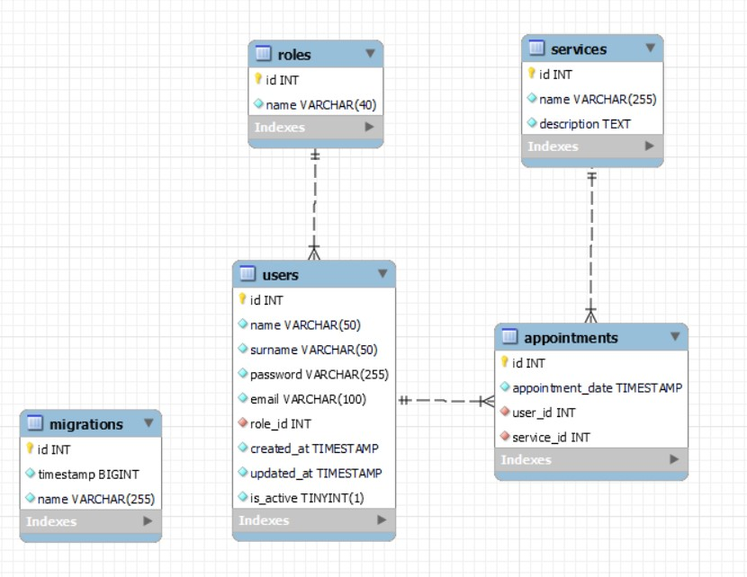
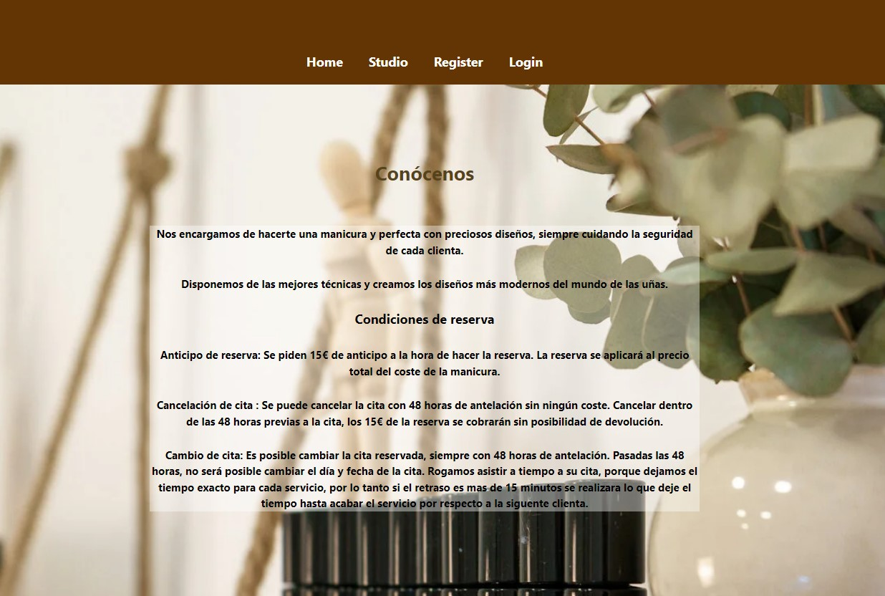
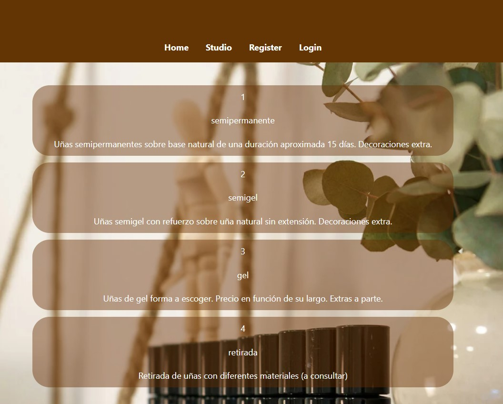
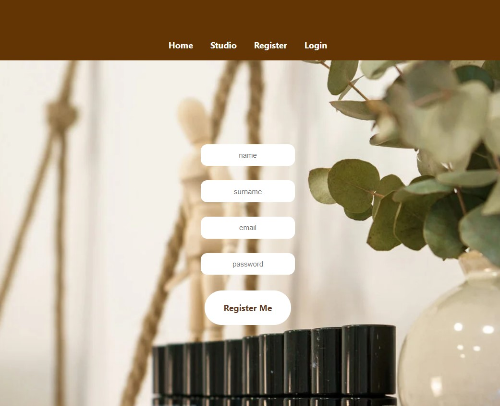
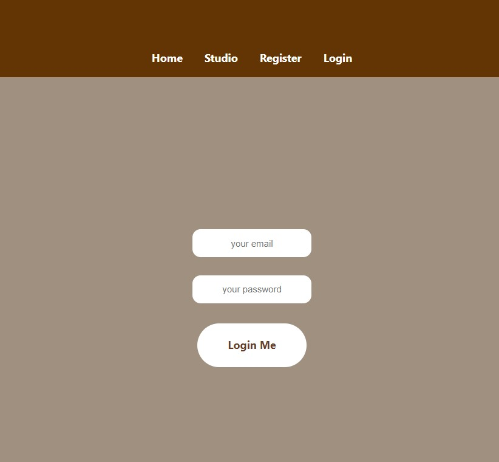

# Nails Studio II :hand: 


### Content

1. [Description](#description)
2. [Objective](#objective)
3. [Stack](#stack)
4. [Backend project](#connect-with-backend-project)
5. [Data Base schema](#data-base-schema)
6. [Views](#views)
7. [API](#about-the-api)
8. [Run it](#how-to-run-it)
9. [To improve](#to-improve)
10. [Agreements](#agreements)


### Description :bulb:

The app is based on a simulated study where clients can register and request appointments with the various services offered by the salon.

### Objective 🙌
The main objective of the application is to allow users to schedule their appointments and choose the service they desire.

### Stack  :wrench:


### Connect with Backend project :v:  :computer:

https://github.com/marinaescriva/nails_studio.git


### Data Base Schema :pushpin: 



### Views

#### Home


#### Services


#### Register


#### Login


#### Super admin view


### About the API 😃

- Secure loggin with secret password.
- Easy and userfriendly interface design.
- Admin pannel for control DB users registered.
- Update profile user when is logged.
- Create and delete your personal appointments.
- Consult the available services in Studio slide.

### How to run it :mag:

Clone this repository and the backend repository linked up.
Open VSC and do in both projects.

```
$ npm i 
$ npm run dev
```

### To improve :point_up:

Some extras can be updated in this proyect: 

- Use Boostrap and configure all website in responsive environment.
- Add more information and images about the bussiness.
- Add to chage more fileds in profile update endpoint.

### Agreements :clap:

For their support and help during this project <3

[<i class="fab fa-github"></i> Fran](https://github.com/FRR95)
[<i class="fab fa-github"></i> Pedro](https://github.com/Eryhnar)
[<i class="fab fa-github"></i> Carlos](https://github.com/CariblaGIT)
[<i class="fab fa-github"></i> Marta](https://github.com/MartaGBayona)
[<i class="fab fa-github"></i> Ana](https://github.com/ariusvi)
[<i class="fab fa-github"></i> Victor](https://github.com/VictorBlasco5)

